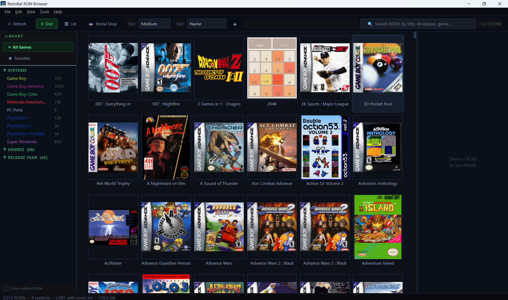
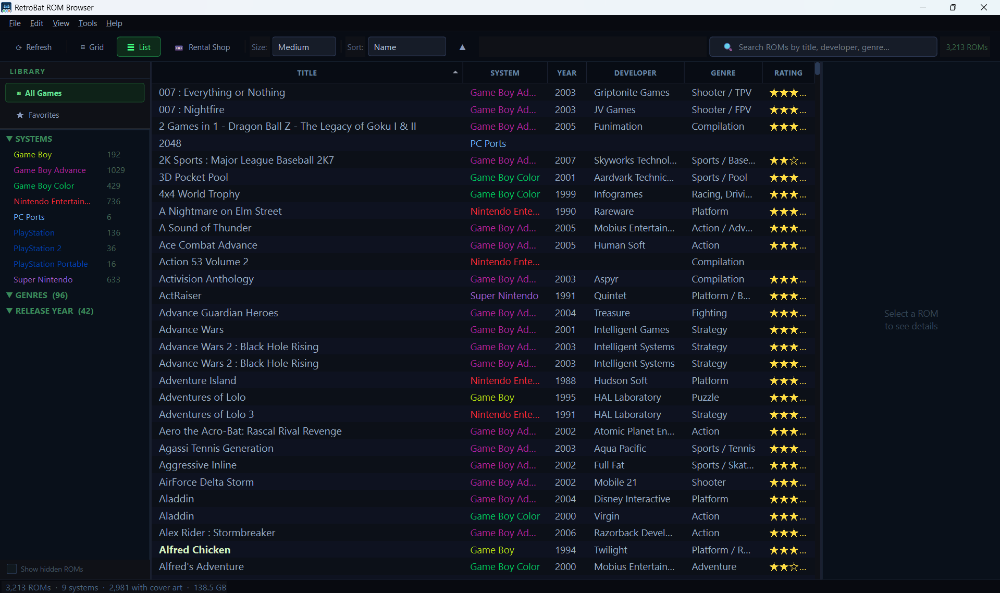
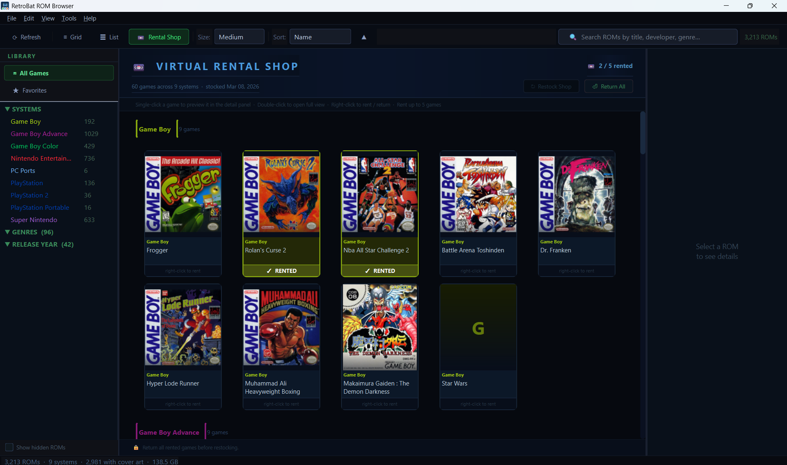
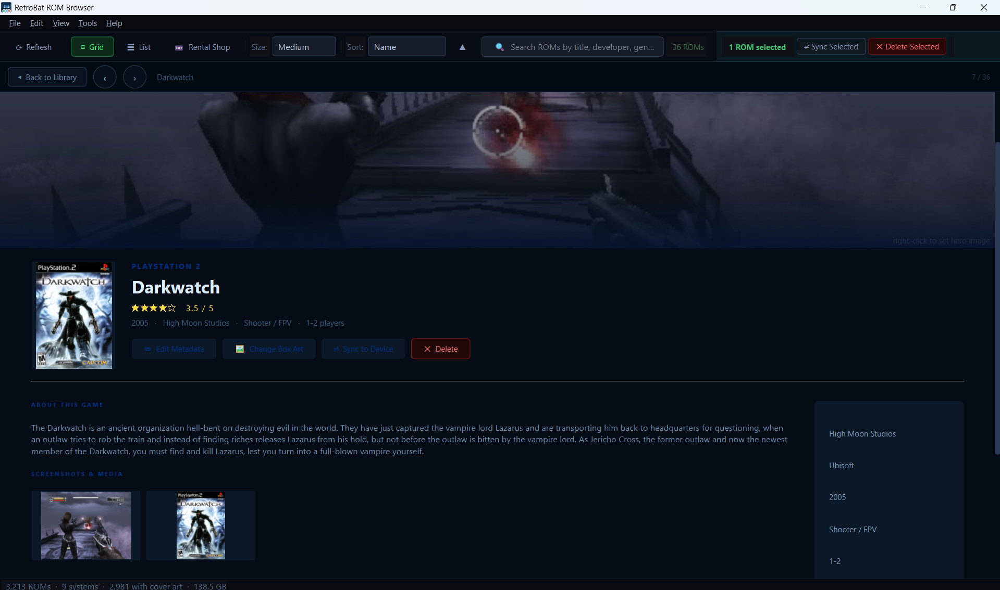
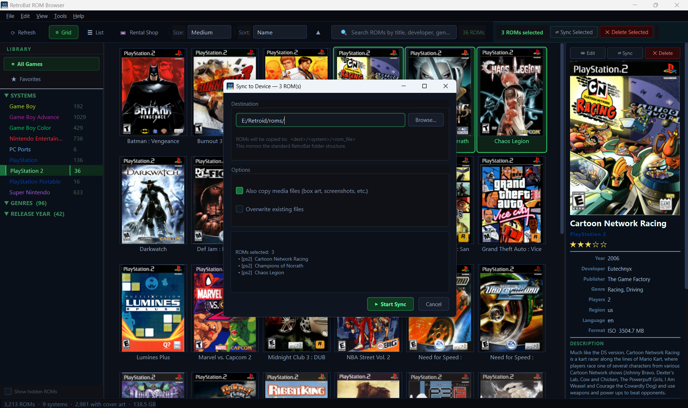
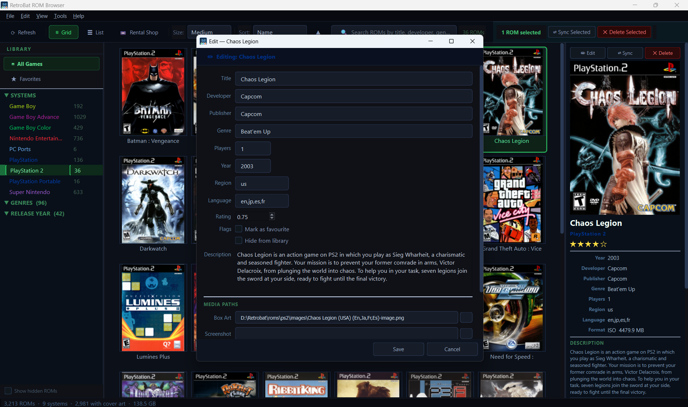

# RetroBat Rom Browser

This is a program I made to browse and manage my rom library outside of Emulation Station.

# Requirements
RetroBat

# Setup

Download the .exe from Releases. You can run it from any location. When you run it for the first time you will have to set the location of your rom library. 

---

# Why RetrotBat Specifically?

Mainly for ease of use. Between RetroBat's tweaks and Emulation Station's quirks, you end up with rather specific naming convetions for media that isn't always true for other Emulation Station setups. Since I use RetroBat I just worked with those quirks rather than trying to generalize the program.

# Features

**Sync:** This was one of the main reason. Easily browsing rom library and choosing games to sync to my retro handhelds.

**Browse and Mange:** Scroll through your library as a grid or a list, edit metadata, update cover art, add to favorites.

**Virtual Rental Shop:** A large rom library can make hard to pick what to play. The VRS chooses around 10 games per system in your collection and allows you to rent 5 of them at a time. Every 7 days the VRS updates it's invenotry after all of your current rentals are retunred. 

# Screenshots

**Grid View**

**List View**

**Virtual Rental Shop**

**Game Detail View**

**Sync Menu**

**Metadata Updatae Menu**

